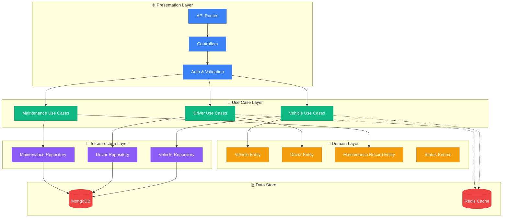

<div align="center">
  <h1>🚛 Fleet OS Fleet Service</h1>
  <p>
    <strong>Vehicle & Maintenance Management Microservice</strong>
  </p>

[](https://opensource.org/licenses/ISC)


  <p>
    <a href="#-overview">Overview</a> •
    <a href="#-architecture">Architecture</a> •
    <a href="#-key-features">Features</a> •
    <a href="#-technology-stack">Tech Stack</a> •
    <a href="#-getting-started">Getting Started</a> •
    <a href="#-api-endpoints">API</a>
  </p>
</div>

---

## 📖 Overview

The **Fleet OS Fleet Service** is a comprehensive microservice for managing vehicles, drivers, and maintenance operations within the Fleet OS platform. It provides robust vehicle lifecycle management, real-time tracking, driver assignment, and proactive maintenance scheduling to optimize fleet operations.

### 🎯 Purpose

This service serves as the core operational hub for fleet management, handling:

- **Vehicle Management**: Complete CRUD operations for fleet vehicles
- **Driver Operations**: Driver profiles, onboarding, and assignment
- **Maintenance Tracking**: Preventive and reactive maintenance scheduling
- **Vehicle Lifecycle**: Status tracking from acquisition to disposal
- **Assignment Management**: Vehicle-driver assignment and rotation

---

## ✨ Key Features

### 🚗 Vehicle Management

- **Complete Vehicle CRUD**: Create, read, update, and delete vehicle records
- **Multi-Tenant Support**: Vehicles isolated by tenant organization
- **Vehicle Status Tracking**: ACTIVE, INACTIVE, MAINTENANCE, RETIRED states
- **Detailed Vehicle Profiles**: Make, model, year, VIN, license plate, color
- **Mileage & Usage Tracking**: Current mileage, fuel type, seating capacity
- **Custom Metadata**: Flexible JSON storage for additional vehicle data

### 👤 Driver Management

- **Driver Profiles**: Comprehensive driver information management
- **License Tracking**: Driver's license number, type, and expiry
- **Onboarding Workflow**: Structured onboarding process for new drivers  
- **Driver Status**: PENDING, ACTIVE, INACTIVE, SUSPENDED states
- **Experience Tracking**: Years of driving experience and specializations
- **Vehicle Assignment**: Link drivers to specific vehicles

### 🔧 Maintenance Operations

- **Preventive Maintenance**: Schedule regular maintenance tasks
- **Reactive Maintenance**: Log and track issue-based repairs
- **Maintenance Types**: OIL_CHANGE, TIRE_ROTATION, BRAKE_SERVICE, ENGINE_SERVICE, TRANSMISSION_SERVICE, BATTERY_REPLACEMENT, AIR_FILTER_REPLACEMENT, GENERAL_INSPECTION, REPAIR, OTHER
- **Status Tracking**: SCHEDULED, IN_PROGRESS, COMPLETED, CANCELLED
- **Cost Management**: Track labor and parts costs
- **History Logging**: Complete maintenance history per vehicle
- **Reminder System**: Automated maintenance due date notifications

### 📊 Advanced Features

- **Multi-Status Filtering**: Query vehicles and drivers by status
- **Pagination Support**: Efficient data retrieval for large fleets
- **Tenant Isolation**: Complete data separation between organizations
- **Audit Logging**: Track all changes with timestamps
- **Soft Delete**: Mark records as deleted without physical removal

---

## 🏛 Architecture

Built on **Clean Architecture** principles with Domain-Driven Design.



### 🧠 Design Patterns

- **Clean Architecture**: Complete separation of concerns across layers
- **Repository Pattern**: Abstract data access behind interfaces
- **Entity Pattern**: Rich domain models with business logic
- **Use Case Pattern**: Single-responsibility business operations
- **DTO Pattern**: Zod schemas for type-safe data validation

---

## 🛠 Technology Stack

| Category       | Technology                                                                                                      | Purpose                   |
| :------------- | :-------------------------------------------------------------------------------------------------------------- | :------------------------ |
| **Runtime**    |          | JavaScript runtime        |
| **Language**   |  | Type-safe development     |
| **Framework**  |        | Web framework             |
| **Database**   |           | Document database         |
| **Cache**      |                 | Caching layer             |
| **Validation** | **Zod**                                                                                                         | Runtime type checking     |
| **Logging**    | **Winston**                                                                                                     | Structured logging        |
| **Testing**    | **Jest**                                                                                                        | Unit & integration tests  |
| **HTTP Client** | **Axios**                                                                                                      | Service communication     |
| **Messaging**  | **KafkaJS**                                                                                                     | Event streaming           |

---

## 📂 Project Structure

```
fleet-os-fleet-service/
├── src/
│   ├── config/                  # ⚙️ Configuration
│   │   ├── database.ts          # MongoDB connection
│   │   ├── redis.ts             # Redis client
│   │   ├── kafka.ts             # Kafka producer/consumer
│   │   └── env.ts               # Environment validation
│   │
│   ├── domain/                  # 🎯 Core business domain
│   │   ├── entities/            # Domain entities
│   │   │   ├── vehicle.entity.ts
│   │   │   ├── driver.entity.ts
│   │   │   └── maintenance-record.entity.ts
│   │   ├── enums/               # Domain enumerations
│   │   │   ├── vehicle-status.enum.ts
│   │   │   ├── driver-status.enum.ts
│   │   │   └── maintenance-type.enum.ts
│   │   └── errors/              # Custom domain errors
│   │
│   ├── use-cases/                 # 💼 Application business logic
│   │   ├── vehicle/
│   │   │   ├── create-vehicle/
│   │   │   ├── get-vehicle/
│   │   │   ├── list-vehicles/
│   │   │   ├── update-vehicle/
│   │   │   ├── delete-vehicle/
│   │   │   └── update-vehicle-status/
│   │   ├── driver/
│   │   │   ├── create-driver/
│   │   │   ├── get-driver/
│   │   │   └── update-driver-status/
│   │   └── maintenance/
│   │       ├── create-maintenance-record/
│   │       ├── list-maintenance-records/
│   │       ├── update-maintenance-status/
│   │       └── get-vehicle-maintenance-history/
│   │
│   ├── infrastructure/          # 🏗️ External interfaces
│   │   ├── repositories/        # Data persistence
│   │   │   ├── vehicle.repository.ts
│   │   │   ├── driver.repository.ts
│   │   │   └── maintenance.repository.ts
│   │   └── models/              # Mongoose schemas
│   │       ├── Vehicle.ts
│   │       ├── Driver.ts
│   │       └── MaintenanceRecord.ts
│   │
│   ├── presentation/            # 🌐 API layer
│   │   ├── controllers/         # Request handlers
│   │   │   ├── vehicle.controller.ts
│   │   │   ├── driver.controller.ts
│   │   │   └── maintenance.controller.ts
│   │   ├── middlewares/         # Request processing
│   │   │   ├── auth.middleware.ts
│   │   │   └── validate.middleware.ts
│   │   └── routes/              # API routes
│   │       ├── vehicle.routes.ts
│   │       ├── driver.routes.ts
│   │       └── maintenance.routes.ts
│   │
│   ├── di/                      # 💉 Dependency injection
│   │   └── container.ts
│   │
│   ├── app.ts                   # Express app setup
│   └── index.ts                 # Server entry point
│
├── tests/                       # 🧪 Test suites
├── .env.example                 # Environment template
├── Dockerfile                   # Production container
└── package.json
```

---

## 🚀 Getting Started

### Prerequisites

- **Node.js** >= 20.x
- **pnpm** >= 9.x
- **MongoDB** >= 6.x
- **Redis** >= 7.x (optional, for caching)

### Installation

1. **Clone the repository**

```bash
git clone https://github.com/ijas9118/fleet-os-fleet-service.git
cd fleet-os-fleet-service
```

2. **Install dependencies**

```bash
pnpm install
```

3. **Configure environment**

```bash
cp .env.example .env
# Edit .env with your configuration
```

4. **Run development server**

```bash
pnpm dev
```

The service will start on `http://localhost:3003` (or your configured port).

### Running Tests

```bash
# Run all tests
pnpm test

# Watch mode
pnpm test:watch

# Generate coverage report
pnpm test:coverage
```

### Building for Production

```bash
# Type check
pnpm typecheck

# Build
pnpm build

# Start production server
pnpm start
```

---

## 🔌 API Endpoints

Base URL: `/api/v1`

### 🚗 Vehicle Endpoints

| Method   | Endpoint                     | Description                    | Roles                                     |
| :------- | :--------------------------- | :----------------------------- | :---------------------------------------- |
| `POST`   | `/vehicles`                  | Create new vehicle             | `TENANT_ADMIN`, `OPERATIONS_MANAGER`      |
| `GET`    | `/vehicles`                  | List all vehicles (paginated)  | `TENANT_ADMIN`, `OPERATIONS_MANAGER`      |
| `GET`    | `/vehicles/:id`              | Get vehicle by ID              | `TENANT_ADMIN`, `OPERATIONS_MANAGER`      |
| `PATCH`  | `/vehicles/:id`              | Update vehicle details         | `TENANT_ADMIN`, `OPERATIONS_MANAGER`      |
| `DELETE` | `/vehicles/:id`              | Delete vehicle (soft delete)   | `TENANT_ADMIN`                            |
| `PATCH`  | `/vehicles/:id/status`       | Update vehicle status          | `TENANT_ADMIN`, `OPERATIONS_MANAGER`      |
| `GET`    | `/vehicles/status/:status`   | Get vehicles by status         | `TENANT_ADMIN`, `OPERATIONS_MANAGER`      |

**Query Parameters for List Vehicles:**
- `page` - Page number (default: 1)
- `limit` - Items per page (default: 10)
- `search` - Search by make, model, or VIN
- `status` - Filter by vehicle status

### 👤 Driver Endpoints

| Method  | Endpoint                   | Description                  | Roles                                                  |
| :------ | :------------------------- | :--------------------------- | :----------------------------------------------------- |
| `POST`  | `/drivers`                 | Create new driver            | `TENANT_ADMIN`, `OPERATIONS_MANAGER`                   |
| `GET`   | `/drivers`                 | List all drivers (paginated) | `TENANT_ADMIN`, `OPERATIONS_MANAGER`                   |
| `GET`   | `/drivers/:id`             | Get driver by ID             | `TENANT_ADMIN`, `OPERATIONS_MANAGER`, `DRIVER` (self)  |
| `PATCH` | `/drivers/:id`             | Update driver details        | `TENANT_ADMIN`, `OPERATIONS_MANAGER`                   |
| `PATCH` | `/drivers/:id/status`      | Update driver status         | `TENANT_ADMIN`, `OPERATIONS_MANAGER`                   |
| `GET`   | `/drivers/status/:status`  | Get drivers by status        | `TENANT_ADMIN`, `OPERATIONS_MANAGER`                   |

**Query Parameters for List Drivers:**
- `page` - Page number (default: 1)
- `limit` - Items per page (default: 10)
- `search` - Search by name, email, or license number
- `status` - Filter by driver status

### 🔧 Maintenance Endpoints

| Method  | Endpoint                                  | Description                        | Roles                               |
| :------ | :---------------------------------------- | :--------------------------------- | :---------------------------------- |
| `POST`  | `/maintenance`                            | Create maintenance record          | `TENANT_ADMIN`, `OPERATIONS_MANAGER` |
| `GET`   | `/maintenance`                            | List all maintenance (paginated)   | `TENANT_ADMIN`, `OPERATIONS_MANAGER` |
| `GET`   | `/maintenance/:id`                        | Get maintenance record by ID       | `TENANT_ADMIN`, `OPERATIONS_MANAGER` |
| `PATCH` | `/maintenance/:id`                        | Update maintenance record          | `TENANT_ADMIN`, `OPERATIONS_MANAGER` |
| `PATCH` | `/maintenance/:id/status`                 | Update maintenance status          | `TENANT_ADMIN`, `OPERATIONS_MANAGER` |
| `GET`   | `/maintenance/vehicle/:vehicleId`         | Get vehicle maintenance history    | `TENANT_ADMIN`, `OPERATIONS_MANAGER` |
| `GET`   | `/maintenance/upcoming`                   | Get upcoming scheduled maintenance | `TENANT_ADMIN`, `OPERATIONS_MANAGER` |

**Query Parameters for List Maintenance:**
- `page` - Page number (default: 1)
- `limit` - Items per page (default: 10)
- `vehicleId` - Filter by vehicle
- `type` - Filter by maintenance type
- `status` - Filter by status

---

## 📝 Data Models

### Vehicle Entity

```typescript
{
  id: string;
  tenantId: string;
  make: string;                  // e.g., "Ford", "Toyota"
  model: string;                 // e.g., "F-150", "Camry"
  year: number;                  // e.g., 2023
  vin: string;                   // Vehicle Identification Number
  licensePlate: string;
  color?: string;
  status: VehicleStatus;         // ACTIVE, INACTIVE, MAINTENANCE, RETIRED
  currentMileage: number;
  fuelType?: string;             // e.g., "Gasoline", "Diesel", "Electric"
  seatingCapacity?: number;
  assignedDriverId?: string;
  metadata?: Record<string, any>; // Custom fields
  createdAt: Date;
  updatedAt: Date;
  deletedAt?: Date;
}
```

### Driver Entity

```typescript
{
  id: string;
  tenantId: string;
  userId: string;                // Reference to auth service user
  licenseNumber: string;
  licenseType: string;          // e.g., "Class A", "Class B"
  licenseExpiry: Date;
  status: DriverStatus;         // PENDING, ACTIVE, INACTIVE, SUSPENDED
  yearsOfExperience?: number;
  assignedVehicleId?: string;
  metadata?: Record<string, any>;
  createdAt: Date;
  updatedAt: Date;
}
```

### Maintenance Record Entity

```typescript
{
  id: string;
  tenantId: string;
  vehicleId: string;
  type: MaintenanceType;        // OIL_CHANGE, TIRE_ROTATION, BRAKE_SERVICE, ENGINE_SERVICE, etc.
  status: MaintenanceStatus;    // SCHEDULED, IN_PROGRESS, COMPLETED, CANCELLED
  description: string;
  scheduledDate: Date;
  completedDate?: Date;
  mileageAtService: number;
  cost?: {
    labor?: number;
    parts?: number;
    total: number;
  };
  performedBy?: string;         // Mechanic/service provider
  notes?: string;
  createdAt: Date;
  updatedAt: Date;
}
```

---

## 🔐 Authentication & Authorization

This service relies on the **Fleet OS Auth Service** for authentication:

- **Authentication**: JWT tokens validated via middleware
- **Authorization**: Role-Based Access Control (RBAC)
  - `PLATFORM_ADMIN` - Full platform access
  - `TENANT_ADMIN` - Tenant-wide management
  - `OPERATIONS_MANAGER` - Fleet operations management
  - `DRIVER` - Limited read access to own data

All requests require valid JWT access tokens in the `Authorization` header:
```
Authorization: Bearer <access_token>
```

---

## 🧪 Testing

The service includes comprehensive test coverage:

```bash
pnpm test              # Run all tests
pnpm test:watch        # Watch mode
pnpm test:coverage     # Generate coverage report
```

---

## 📊 Environment Variables

| Variable               | Description                | Required | Default       |
| :--------------------- | :------------------------- | :------- | :------------ |
| `NODE_ENV`             | Environment mode           | No       | `development` |
| `PORT`                 | Server port                | No       | `3003`        |
| `DATABASE_URL`         | MongoDB connection string  | Yes      | -             |
| `REDIS_URL`            | Redis connection URL       | No       | -             |
| `AUTH_SERVICE_URL`     | Auth service base URL      | Yes      | -             |
| `INTERNAL_API_KEY`     | Service-to-service API key | Yes      | -             |
| `JWT_PUBLIC_KEY_PATH`  | Path to JWT public key     | Yes      | -             |
| `KAFKA_BROKERS`        | Kafka broker URLs          | No       | -             |

---

## 🤝 Contributing

Contributions are welcome! Please follow these steps:

1. Fork the repository
2. Create a feature branch (`git checkout -b feature/amazing-feature`)
3. Commit your changes (`git commit -m 'Add amazing feature'`)
4. Push to the branch (`git push origin feature/amazing-feature`)
5. Open a Pull Request

---

## 📄 License

This project is licensed under the **ISC License**.

---

<div align="center">
  <p>Built with ❤️ for the Fleet OS Platform</p>
  <p>
    <a href="https://github.com/ijas9118/fleet-os-fleet-service">GitHub</a> •
    <a href="https://github.com/ijas9118/fleet-os-fleet-service/issues">Issues</a>
  </p>
</div>
